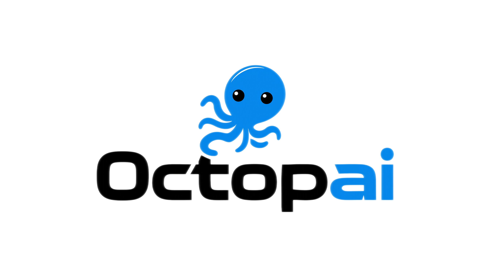

<div align="center">




<p align="center">
  <h1 align="center">Octopai 🐙</h1>
</p>

<p align="center">
  <strong>AI Agent 探索、扩展、进化智能引擎 🚀</strong>
</p>

<p align="center">
  万物皆可为Skill • Skill在学习中不断自我进化 • 提升AI Agent认知能力
</p>

<p align="center">
  <a href="https://opensource.org/licenses/MIT">
    
  </a>
  <a href="https://www.python.org/">
    
  </a>
  <a href="https://github.com/Yuan-ManX/octopai">
    
  </a>
</p>


#### [English](./README.md) | [中文文档](./README_CN.md)


</div>


## 概述

Octopai是一个革命性的AI Agent Skills探索、扩展、进化智能引擎，其核心原则是：**万物皆可为Skill，Skill在学习中不断自我进化，提升AI Agent认知能力。**服务于OpenClaw、Claude Code、Codex、Cursor等智能体系统，Octopai将任何资源——网页、文档、视频、代码、数据集等——转化为结构化、可复用的Skill内容。通过智能学习和持续的自我进化，Skill会随着时间不断成长和改进，显著提升AI Agent的认知能力。

Octopai的核心理念是知识不应是静态的。每一个用Octopai创建的Skill都能从交互中持续学习，通过反思来自我完善，并不断进化，变得更强大、更全面，更好地适应AI Agent不断变化的需求。

## 核心理念

Octopai的革命性理念围绕我们的基础使命和原则展开：


#### 使命：探索、扩展、进化AI Agent的认知

Octopai的核心理念是通过三大支柱提升AI Agent的认知能力：

- **探索**互联网上海量的知识和各种文件格式的资源
- **扩展**AI Agent通过结构化、可复用的技能的能力
- **进化**技能通过智能反思和优化以匹配Agent需求


#### 原则：万物皆可为Skill，Skill在学习中不断进化

Octopai的突破性方法建立在两个变革性原则之上：

- **万物皆可为Skill**：任何资源——网页、PDF、视频、代码、数据集、文章——都可以转化为结构化的、AI就绪的Skill
- **Skill在学习中不断进化**：每一个Skill都从使用、反馈和交互中持续学习，随着时间变得更加强大

这些原则和支柱共同构成了Octopai的革命性生态系统，在这里万物皆可为Skill，每一个Skill都持续进化以扩展AI Agent的认知。


## ✨ 核心功能

### ⚡ 一键URL到Skill转换
将任何互联网资源即时转换为结构化、AI就绪的技能：
- **网页**：通过一条命令将URL转换为结构化Markdown
- **自动爬取**：获取并整理链接的资源
- **技能就绪输出**：直接可供Claude Code、Cursor等AI Agent使用

### 🧩 多格式资源解析器
解析并转换**任何文件格式**为技能就绪的资源：
- **文档**：PDF、DOC、DOCX
- **表格**：Excel (XLSX, XLS)、CSV
- **媒体**：图片 (JPG、PNG、GIF)、视频 (MP4、AVI、MOV)
- **网页**：HTML、带自动爬取的URL
- **文本**：Markdown、JSON、YAML、纯文本

### 🚀 智能进化引擎
先进的进化引擎，具备全面的功能：
- **课程学习**：通过结构化的层级渐进式技能开发
- **目标导向进化**：朝着特定目标的定向进化
- **自我验证**：技能改进的自动验证
- **元认知**：反思学习和自适应策略
- **自适应变异**：探索性、优化性和反思性变异策略

### 💼 SkillHub - 全面的技能管理中心
在集中式、智能存储库中存储、组织、进化和管理您的技能：
- **全面的元数据**：状态、可见性、作者、版本、许可证、关键词、依赖关系等
- **持久化存储**：技能保存到磁盘，带有完整历史记录
- **版本控制**：跟踪技能进化，带有完整版本历史
- **版本对比**：比较版本，带有详细的变更分析
- **回滚功能**：即时恢复到以前的版本
- **发布工作流**：草稿→评审→发布→弃用→归档状态管理
- **可见性控制**：私有、内部或公开可见性级别
- **智能集合**：将技能组织成精心策划的集合
- **标签与分类**：灵活的分类和标签系统
- **技能评分**：用户反馈和评分系统
- **语义搜索**：基于令牌索引和相关性评分的智能搜索
- **上下文组合**：将技能组合成强大的上下文组合
- **技能依赖**：跟踪技能之间的关系
- **技能合并**：将互补技能合并为更强大的技能
- **使用分析**：跟踪技能使用情况、成功率和性能指标

```python
from octopai import (
    Octopai, hub_create, hub_search, hub_list, hub_stats,
    hub_create_collection, hub_semantic_search, hub_publish
)

# 在SkillHub中创建技能
skill = hub_create(
    name="数据分析器",
    description="分析CSV数据文件",
    prompt="创建一个分析CSV数据的技能",
    tags=["数据", "csv", "分析"],
    category="数据处理"
)

# 创建集合
collection = hub_create_collection(
    name="数据科学工具",
    description="数据科学的基础技能",
    skill_ids=[skill.metadata.skill_id],
    tags=["数据科学", "工具"]
)

# 带高级评分的语义搜索
results = hub_semantic_search("csv分析", category="数据处理")

# 发布技能
published = hub_publish(skill.metadata.skill_id, visibility="public")

# 列出所有技能
all_skills = hub_list(category="数据处理")

# 获取统计信息
stats = hub_stats()
```

### 🔗 双接口：Python API + 命令行
以最适合您的方式使用Octopai：
- **Python API**：直接导入到您的项目中，实现无缝集成
- **命令行**：通过终端快速操作和自动化

### 🌐 Web应用与REST API
具有全面REST API的全栈Web应用：
- **现代Web UI**：美观、直观的技能管理前端
- **REST API端点**：所有SkillHub操作的完整API
- **异步任务管理**：带状态跟踪的后台任务处理
- **集成就绪**：设计用于与其他系统轻松集成

### 🔄 工作流引擎 - 高级技能编排
强大的工作流引擎，用于编排复杂的技能序列：
- **多格式工作流**：支持YAML、JSON和Markdown工作流定义
- **渐进式加载**：仅在需要时加载技能，优化上下文使用
- **条件执行**：基于智能条件的步骤执行
- **重试与超时**：内置重试机制和超时处理
- **Python和技能操作**：无缝执行Python函数和现有技能
- **API集成**：直接API调用作为工作流步骤

```python
from octopai import WorkflowEngine, WorkflowDefinition, WorkflowStep

# 初始化工作流引擎
engine = WorkflowEngine()

# 以编程方式创建工作流
workflow = WorkflowDefinition(
    name="研究报告生成器",
    version="1.0.0",
    description="生成全面的研究报告",
    author="Octopai团队",
    tags=["研究", "报告", "自动化"],
    variables={"topic": "AI Agents", "output_format": "markdown"}
)

# 添加工作流步骤
workflow.steps.append(WorkflowStep(
    name="web_research",
    description="在线研究主题",
    action="skill:web_research",
    inputs={"query": "${topic}"},
    outputs=["research_data"]
))

workflow.steps.append(WorkflowStep(
    name="generate_report",
    description="生成最终报告",
    action="skill:report_generation",
    inputs={"data": "${research_data}", "format": "${output_format}"},
    outputs=["final_report"]
))

# 执行工作流
results = await engine.execute_workflow(workflow)
print(results["final_report"])
```

### 🧠 子任务编排器 - 智能任务分解
用于分解和执行复杂任务的高级系统：
- **自动任务分解**：AI驱动的任务分解为可并行的子任务
- **依赖管理**：智能依赖解析和执行排序
- **基于优先级的执行**：关键子任务的动态优先级
- **并行执行**：独立子任务的并发执行
- **进度跟踪**：实时状态监控和完成回调
- **错误恢复**：自动重试和从子任务失败中恢复

```python
from octopai import SubtaskOrchestrator

# 初始化编排器
orchestrator = SubtaskOrchestrator()

# 分解复杂任务
task_group = await orchestrator.decompose_task(
    main_task="创建一个关于AI Agents的综合网站",
    context={"target_audience": "developers", "style": "modern"}
)

# 执行分解后的任务
result = await orchestrator.execute_subtask_group(task_group.id)

print(f"完成 {result['completed_count']} 个任务，共 {result['total_count']} 个")
print("结果：", result["results"])
```

### 💾 持久化记忆 - 用户偏好学习
用于个性化交互的复杂记忆系统：
- **事实记忆**：存储和检索带有置信度评分的事实知识
- **用户偏好**：随时间学习和适应用户偏好
- **对话历史**：维护过去交互的结构化摘要
- **写作风格**：捕捉和应用用户的写作风格
- **技术栈**：跟踪用户的技术偏好
- **自动提取**：从对话中AI驱动的记忆提取
- **上下文检索**：基于当前任务的智能上下文注入

```python
from octopai import PersistentMemory

# 初始化记忆系统
memory = PersistentMemory()

# 存储事实
memory.add_fact(
    user_id="user_123",
    content="在数据分析方面更喜欢Python而非JavaScript",
    category="preference",
    source="conversation",
    confidence=0.9,
    tags=["编程", "数据分析"]
)

# 设置用户偏好
memory.set_preference(
    user_id="user_123",
    key="output_format",
    value="markdown",
    category="formatting",
    description="文档的首选输出格式",
    strength=0.8
)

# 获取任务的记忆上下文
context = memory.get_memory_context(
    user_id="user_123",
    current_task="生成数据分析报告"
)

print("用户事实：", context["facts"])
print("用户偏好：", context["preferences"])
```

### 🛡️ 沙箱执行器 - 隔离执行环境
用于代码和命令的安全隔离执行环境：
- **会话管理**：创建和管理隔离的沙箱会话
- **文件系统**：完整的虚拟文件系统，包含上传、工作区和输出
- **命令执行**：带超时和安全策略的安全命令执行
- **Python执行**：在隔离环境中运行Python代码
- **笔记本支持**：Jupyter笔记本单元执行
- **安全策略**：可配置的允许/阻止命令列表
- **执行历史**：所有操作的完整审计跟踪

```python
from octopai import SandboxExecutor, SandboxConfig

# 初始化沙箱执行器
executor = SandboxExecutor()

# 使用自定义配置创建沙箱会话
config = SandboxConfig(
    timeout=300,
    max_memory_mb=1024,
    enable_network=False
)
session = executor.create_session(config=config)

# 写入文件
executor.write_file(
    session_id=session.id,
    file_path="workspace/analysis.py",
    content="""
import pandas as pd
data = pd.DataFrame({'x': [1, 2, 3], 'y': [4, 5, 6]})
print(data.describe())
"""
)

# 执行Python代码
result = await executor.execute_python_code(
    session_id=session.id,
    code="import pandas as pd; print(pd.__version__)"
)

print("成功：", result.success)
print("输出：", result.stdout)

# 获取会话摘要
summary = executor.get_session_summary(session.id)
print("会话统计：", summary)
```

### 🔧 高级API
简化访问所有功能：
```python
from octopai import (
    Octopai, convert, create_from_url, create_from_files,
    create_from_prompt, optimize_skill, parse,
    hub_create_collection, hub_semantic_search, hub_publish,
    WorkflowEngine, SubtaskOrchestrator, PersistentMemory, SandboxExecutor
)

# 将URL转换为技能内容
content = convert("https://example.com")

# 解析文件作为资源
resource = parse("document.pdf")

# 从各种来源创建技能
skill1 = create_from_url(
    url="https://example.com",
    name="Web分析",
    description="分析Web内容"
)

skill2 = create_from_files(
    file_paths=["data.csv", "reference.pdf"],
    name="数据处理器",
    description="处理结构化数据"
)

skill3 = create_from_prompt(
    prompt="创建一个生成报告的技能",
    name="报告生成器",
    description="生成全面报告"
)

# 优化现有技能
optimized = optimize_skill(skill1, target_quality="excellent")

# 高级SkillHub操作
collection = hub_create_collection(
    name="我的技能",
    description="我的个人技能集合"
)

results = hub_semantic_search("报告生成", status="published")
```

## 📦 安装

### 前置要求
- Python 3.8或更高版本
- OpenRouter API密钥（在[openrouter.ai](https://openrouter.ai)获取）
- Cloudflare API密钥（可选，用于增强的URL转换）

### 1. 克隆仓库
```bash
git clone https://github.com/Yuan-ManX/octopai.git
cd octopai
```

### 2. 安装依赖
```bash
pip install -r requirements.txt
# 或者开发安装
pip install -e .
```

### 3. 配置API密钥
复制示例环境文件并填写您的值：

```bash
cp .env.example .env
# 编辑 .env 填入您的API密钥
```

您的 `.env` 文件应如下所示：
```env
# OpenRouter API配置（必需）
OPENROUTER_API_KEY=your_openrouter_api_key_here

# Cloudflare API配置（可选）
CLOUDFLARE_API_KEY=your_cloudflare_api_key_here
CLOUDFLARE_ACCOUNT_ID=your_cloudflare_account_id_here

# 模型配置（可选）
OCTOPAI_MODEL=openai/gpt-5.4
```

## 🚀 快速开始

### Python API
```python
from octopai import Octopai

# 初始化Octopai
octopai = Octopai()

# 将URL转换为Markdown
content = octopai.convert_url("https://example.com")

# 解析文件作为资源
resource = octopai.parse_file("data/document.pdf")
print(resource.to_skill_resource())

# 使用资源创建技能
skill = octopai.create_skill_in_hub(
    name="数据分析器",
    description="分析CSV数据文件",
    prompt="创建一个分析CSV数据的技能",
    tags=["数据", "csv", "分析"],
    category="数据处理"
)

# 创建集合
collection = octopai.create_collection_in_hub(
    name="数据科学",
    description="数据科学相关技能",
    skill_ids=[skill.metadata.skill_id]
)

# 添加评分
rating = octopai.add_rating_to_skill_in_hub(
    skill_id=skill.metadata.skill_id,
    rating=5.0,
    feedback="优秀的技能！",
    reviewer="用户"
)

# 语义搜索
results = octopai.semantic_search_in_hub("csv分析")

# 发布技能
published = octopai.publish_skill_in_hub(skill.metadata.skill_id)
```

### 命令行界面
```bash
# 将URL转换为Markdown
octopai convert https://example.com -o output.md --crawler

# 解析文件为技能资源
octopai parse document.pdf -o resource.md

# 创建技能
octopai create "一个CSV分析技能" -n csv-analyzer -o skill.py

# 爬取网站
octopai crawl https://example.com -o ./downloads
```

## 📚 文档

提供完整的中英文双语文档：

- **英文文档**：[docs/en/](./docs/en/index.md)
- **中文文档**：[docs/zh/](./docs/zh/index.md)

快速链接：
- [快速开始](./docs/zh/getting-started.md)
- [API参考](./docs/zh/api-reference.md)
- [CLI使用](./docs/zh/cli-usage.md)
- [示例](./docs/zh/examples.md)
- [高级主题](./docs/zh/advanced-topics.md)
- [FAQ](./docs/zh/faq.md)

## 🏗️ 项目架构

```
octopai/
├── __init__.py           # 包导出
├── api.py                # 高级API接口
├── core/                 # 核心功能模块
│   ├── converter.py      # URL到Markdown转换
│   ├── crawler.py        # 网络爬取和资源下载
│   ├── skill_factory.py  # 技能创建、优化和质量评估
│   ├── evolution_engine.py # 带课程学习和元认知的先进进化引擎
│   ├── experience_tracker.py # 带模式识别的体验跟踪
│   ├── resource_parser.py # 多格式文件解析器（PDF、DOC、Excel等）
│   ├── skill_hub.py     # SkillHub - 全面的技能管理中心
│   ├── skill_packager.py # 技能打包和分发
│   ├── pipeline.py      # 端到端技能工程管道
│   ├── skill_bank.py    # 分层技能库系统
│   ├── experience_distiller.py # 基于经验的技能提取系统
│   ├── recursive_evolution.py # 动态技能进化引擎
│   ├── skill_registry.py # 高级技能注册表系统
│   ├── workflow_engine.py # 🆕 高级工作流编排引擎
│   ├── subtask_orchestrator.py # 🆕 智能任务分解与并行执行
│   ├── persistent_memory.py # 🆕 用户偏好学习与持久化记忆
│   └── sandbox_executor.py # 🆕 隔离执行环境
├── api_integration/      # API集成层
│   ├── __init__.py
│   ├── api.py           # 带异步任务管理的集成API
│   └── schemas.py       # API请求/响应的数据模式
├── cli/                  # 命令行界面
│   └── main.py           # 主命令入口点
├── utils/                # 工具函数
│   ├── __init__.py       # 工具模块导出
│   ├── config.py         # 配置管理
│   └── helpers.py        # 辅助函数
├── web/                  # Web应用
│   ├── backend/         # FastAPI后端
│   │   ├── main.py       # 主FastAPI应用
│   │   └── requirements.txt
│   └── frontend/        # React/Vite前端
│       ├── src/
│       │   ├── components/
│       │   ├── pages/
│       │   ├── api/
│       │   └── App.jsx
│       └── package.json
├── tests/                # 完整的测试套件
│   ├── test_converter.py
│   ├── test_creator.py   # 技能创建器测试
│   ├── test_evolution_engine.py
│   ├── test_evolver.py   # 技能进化器测试
│   ├── test_resource_parser.py
│   └── test_skill_hub.py
├── docs/                 # 文档（英文和中文）
│   ├── en/               # 英文文档
│   └── zh/               # 中文文档
└── examples/             # 使用示例
    ├── advanced_skill_evolution.py
    └── skill_registry_demo.py
```

## 🚀 超级智能体能力

Octopai现在具有全面的超级智能体架构，包括：

```
┌─────────────────────────────────────────────────────────────────┐
│                      Octopai 超级智能体                        │
├─────────────────────────────────────────────────────────────────┤
│  ┌──────────────────┐  ┌──────────────────┐  ┌──────────────┐ │
│  │   工作流引擎     │  │  子任务编排器    │  │   记忆系统    │ │
│  │  & 技能链       │  │  & 并行执行     │  │             │ │
│  └──────────────────┘  └──────────────────┘  └──────────────┘ │
│  ┌──────────────────┐  ┌──────────────────┐  ┌──────────────┐ │
│  │  沙箱执行器     │  │    SkillHub     │  │   进化引擎  │ │
│  │  & 代码运行时   │  │   & 技能库      │  │             │ │
│  └──────────────────┘  └──────────────────┘  └──────────────┘ │
└─────────────────────────────────────────────────────────────────┘
```

**关键超级智能体特性：**
- **统一编排**：无缝协调技能、工作流和子任务
- **自适应学习**：通过记忆和经验持续改进
- **安全执行**：所有代码执行的隔离沙箱环境
- **个性化**：用户特定的偏好和上下文适配
- **可扩展性**：并行执行和智能资源管理


## 💡 技能进化系统

Octopai的进化引擎使用具有多种功能的复杂系统：

```
┌─────────────────┐     ┌─────────────────┐     ┌─────────────────┐
│   任务学习       │ ──▶ │    目标导向进化   │ ──▶ │     自我验证      │
└─────────────────┘     └─────────────────┘     └─────────────────┘
         │                      │                      │
         └──────────────────────┼──────────────────────┘
                                ▼
                       ┌─────────────────┐
                       │   元认知与反思    │
                       └─────────────────┘
```

**关键概念：**
- **课程学习**：通过结构化难度层级的渐进式技能开发
- **目标导向进化**：具有特定目标和优先级的定向进化
- **自我验证**：自动验证和质量保证
- **元认知反思**：基于经验的自适应学习策略
- **模式识别**：从交互中识别成功和失败模式
- **知识转移**：跨技能知识共享和转移
- **记忆整合**：长期记忆形成和检索


## 📄 许可证

本项目采用MIT许可证 - 详见[LICENSE](LICENSE)文件。


## 🤝 贡献

我们欢迎贡献！请参阅我们的贡献指南（即将推出）了解如何开始。


## ⭐ 星标历史

如果您喜欢这个项目，请 ⭐ 给仓库加星。您的支持帮助我们成长！

<p align="center">
  <a href="https://star-history.com/#Yuan-ManX/Octopai&Date">
    
  </a>
</p>


## 📞 支持与社区

- **问题**：[GitHub Issues](https://github.com/Yuan-ManX/octopai/issues)
- **文档**：[docs/](./docs/README.md)


**Octopai** - 赋能AI Agent探索、扩展和进化其认知能力。
